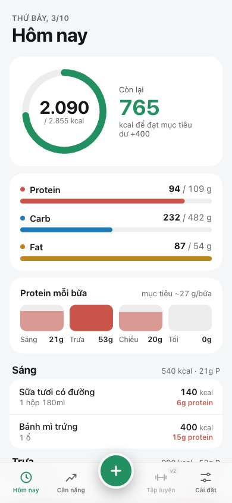
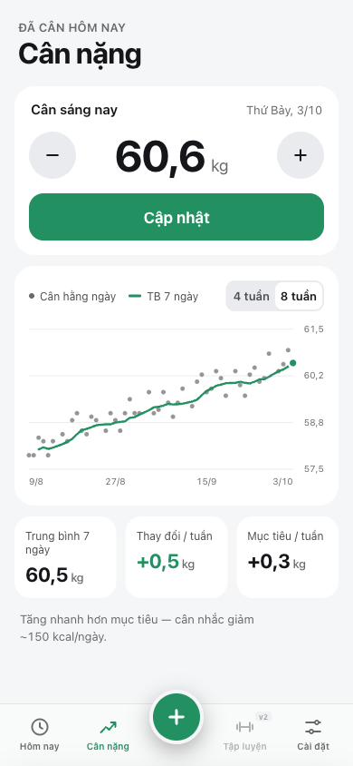
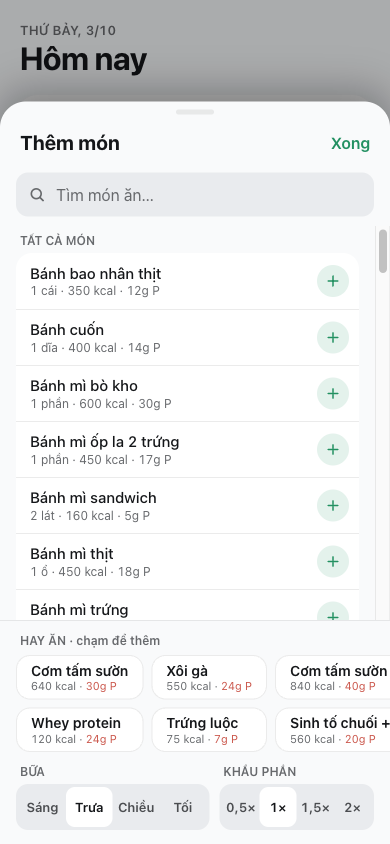
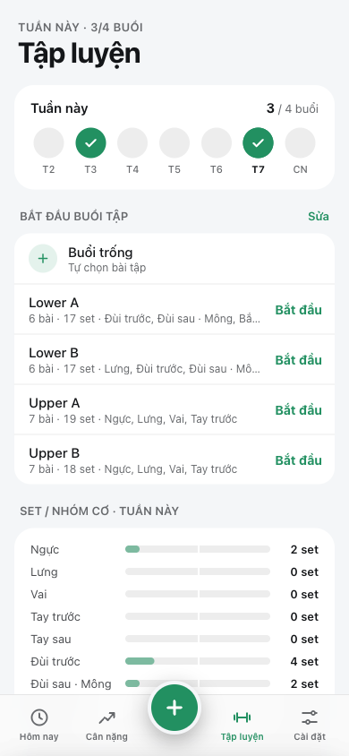
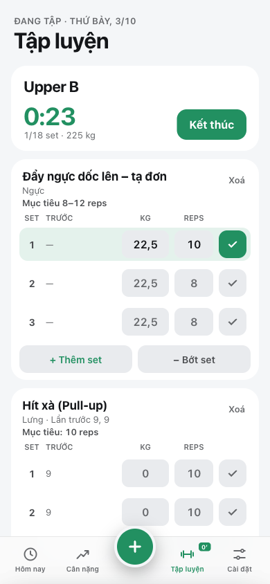
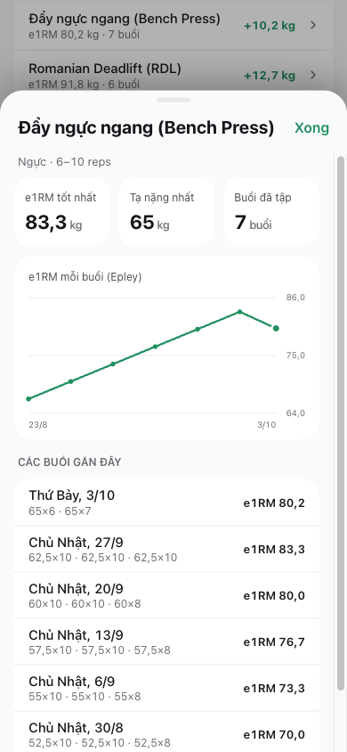
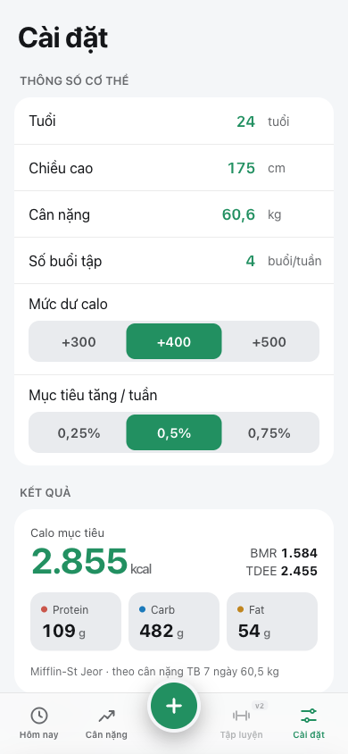
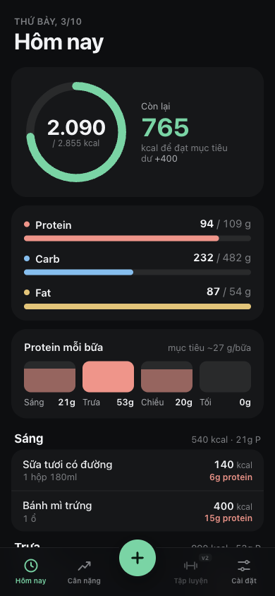
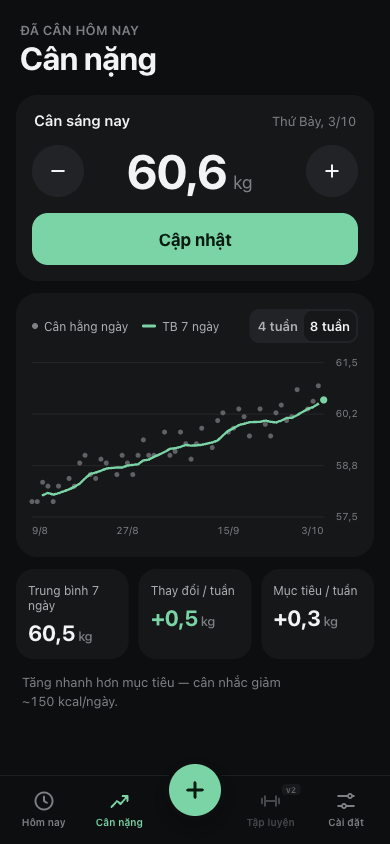

<p align="center">
  
</p>

<h1 align="center">Lên Cân</h1>

<p align="center">
  PWA cá nhân theo dõi calo, macro, cân nặng và buổi tập cho <b>lean bulk</b>.<br>
  Không backend, không đăng nhập, chạy offline, dữ liệu nằm trên máy.
</p>

<p align="center">
  <a href="https://nguyenhau442001.github.io/Gym-Companion/"><b>Mở app →</b></a>
</p>

<p align="center">
  
  
  
</p>

## Tính năng

- **Hôm nay**: vòng calo, thanh Protein / Carb / Fat, protein theo từng bữa (Sáng, Trưa, Chiều, Tối), bữa nào dưới 0,25 g/kg protein sẽ được đánh dấu.
- **Thêm món**: khoảng 50 món Sài Gòn có sẵn (cơm tấm, phở, xôi, bánh mì, whey…). Tìm kiếm không cần gõ dấu. Mục "Hay ăn" lấy 8 món ăn nhiều nhất trong 30 ngày. Thêm một món quen chỉ cần **2 chạm**.
- **Món tự tạo**: thêm, sửa, xoá. Nếu để trống calo thì app tự tính từ macro. Sửa món không làm thay đổi các ngày đã ghi, vì mỗi lần ghi lưu lại macro tại thời điểm đó.
- **Cân nặng**: biểu đồ cân hằng ngày kèm đường trung bình 7 ngày (xem 4 hoặc 8 tuần), thay đổi/tuần so với mục tiêu, và gợi ý tăng/giảm calo.
- **Tập luyện** (v2):
  - Bắt đầu buổi tập từ buổi trống hoặc từ mẫu. Có sẵn 4 mẫu Upper/Lower A/B, thêm, sửa, xoá được mẫu riêng.
  - Ghi từng set theo kg × reps, có cột "Trước" là kết quả lần trước. Chạm ✓ là xong set; nếu chưa nhập thì app lấy giá trị gợi ý.
  - Gợi ý tăng tạ theo **double progression**: khi mọi set đạt reps tối đa thì tăng tạ, ngược lại thì thêm 1 rep.
  - Hẹn giờ nghỉ (có nút ±15s), đồng hồ buổi tập, giữ màn hình sáng khi đang tập. Buổi đang tập vẫn còn nếu lỡ tắt app.
  - Có khoảng 42 bài tập sẵn và bài tự tạo. Tổng quan tuần hiện số buổi so với mục tiêu và **số set/nhóm cơ** (khuyến nghị 10–20 set).
  - Theo dõi tiến độ e1RM từng bài (biểu đồ, kỷ lục), lịch sử buổi tập, báo **kỷ lục mới** khi kết thúc buổi.
- **Cài đặt**: tuổi, chiều cao, cân nặng, số buổi tập, mức dư calo (+300 / +400 / +500), tốc độ tăng mục tiêu (0,25–0,75 %/tuần). Mục tiêu cập nhật ngay khi gõ.
- **Export / Import JSON**: trên iOS dùng Share sheet. Khi import, app kiểm tra file và hiện số lượng bản ghi trước khi ghi đè.
- **PWA**: cài lên Màn hình chính, chạy offline, có banner "Có bản mới — tải lại" khi có bản cập nhật.
- Có giao diện Sáng và Tối.

<p align="center">
  
  
  
</p>

<p align="center">
  
  
  
</p>

## Công thức

| | |
|---|---|
| BMR (Mifflin-St Jeor, nam) | `10·kg + 6,25·cm − 5·tuổi + 5` |
| Hệ số vận động | 0–1 buổi: 1,2 · 2–3: 1,375 · 4–5: 1,55 · 6+: 1,725 |
| Calo mục tiêu | `TDEE + dư calo` (mặc định +400) |
| Protein / Fat | 1,8 g/kg · 0,9 g/kg |
| Carb | `(kcal − protein·4 − fat·9) / 4` |
| Protein mỗi bữa | protein / 4. Bữa bị đánh dấu thấp khi < 0,25 g/kg |
| TB 7 ngày | trung bình các lần cân trong 7 ngày gần nhất, cần ít nhất 3 lần |
| Thay đổi / tuần | `TB7(hôm nay) − TB7(7 ngày trước)` |
| Mục tiêu / tuần | `TB7 × tốc độ` (mặc định 0,5 %) |
| e1RM (Epley) | `kg × (1 + reps/30)` |
| Gợi ý tạ | mọi set đạt reps tối đa thì `+bước tăng` (mặc định 2,5 kg) và quay về reps tối thiểu; ngược lại giữ mức tạ và +1 rep |

Cân nặng dùng để tính mục tiêu là TB 7 ngày. Nếu chưa đủ dữ liệu thì dùng lần cân gần nhất. Ngày luôn tính theo giờ Việt Nam (`Asia/Ho_Chi_Minh`).

## Cài lên iPhone

1. Mở link app bằng **Safari**.
2. Bấm nút Chia sẻ → **Thêm vào MH chính**.
3. Mở app từ icon trên Màn hình chính. Sau lần mở đầu tiên, app chạy được cả khi không có mạng.

> Dữ liệu nằm trong IndexedDB của Safari. Nên **Export** định kỳ để sao lưu.

## Phát triển

Dùng vanilla JS (ES modules), không framework, không bước build, không tải gì từ CDN.

```bash
python3 -m http.server 8000   # mở http://localhost:8000
npm test                      # = node --test (Node 20+)
node scripts/make-icons.mjs   # tạo lại icons/*.png
```

```
index.html            giao diện (từ design/, đã nối dữ liệu thật)
css/app.css
js/calc.js            hàm thuần: công thức dinh dưỡng, ngày, validate backup
js/training.js        hàm thuần: e1RM, gợi ý tạ, thống kê tập
js/workout.js         tab Tập luyện
js/dom.js             helper DOM + toast
js/db.js              IndexedDB "bulk-tracker" v2
js/ui.js              render + xử lý sự kiện
js/app.js             khởi động, service worker
data/foods.seed.js    danh mục món ăn (ước lượng)
data/exercises.seed.js  bài tập + mẫu Upper/Lower
sw.js                 cache-first, CACHE_VERSION
tests/                calc.test.js, training.test.js
design/               bản export gốc từ Claude Design
```

**Phát hành bản mới:** tăng `CACHE_VERSION` trong `sw.js` rồi push lên `main`. Lần mở app tiếp theo sẽ hiện banner "Có bản mới — tải lại".

Macro trong danh mục món là **số ước lượng** cho một khẩu phần thường gặp ở Sài Gòn, chỉ dùng để tham khảo.
